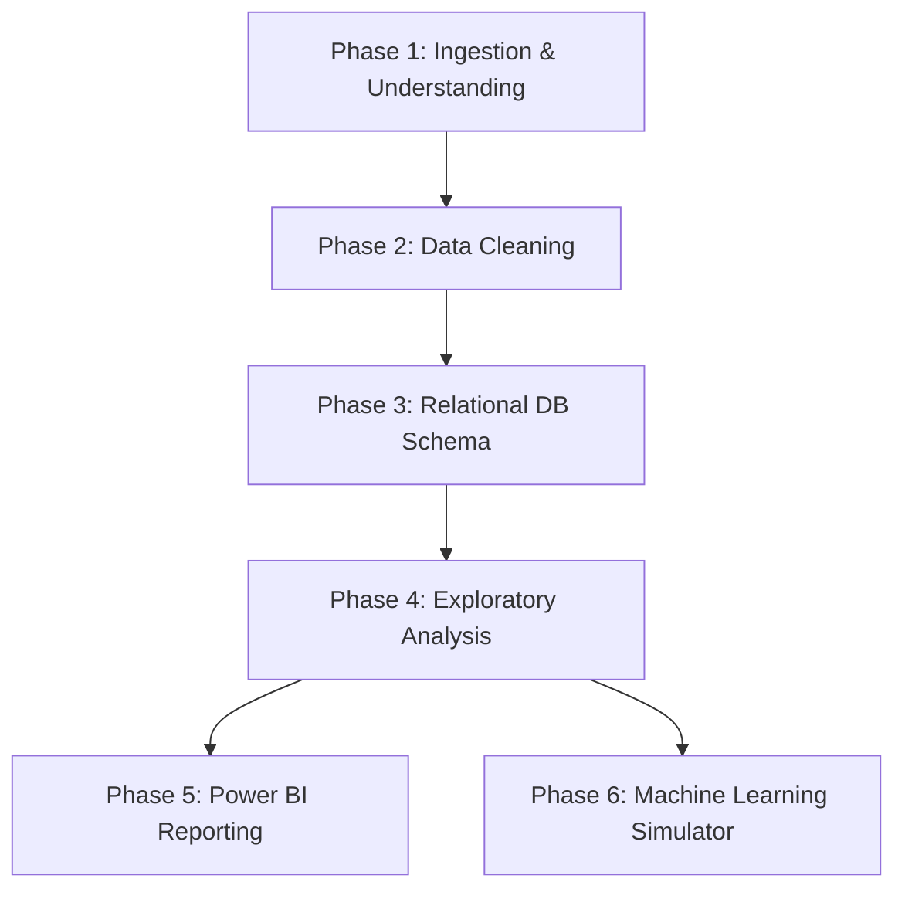

# 🚀 StartupIQ: Analytics and Decision Support Platform

[](#)
[](#)
[](#)
[](LICENSE)

**StartupIQ** is an end-to-end Data Analytics, Business Intelligence, and Predictive Modeling project designed to analyze factors leading to startup success and failure. Combining robust Python ETL pipelines, SQL relational modeling, rich Power BI dashboarding, and Scikit-Learn predictive modeling, StartupIQ offers founders and investors actionable, data-backed insights to maximize business viability.

---

## 🎯 Objectives
- **Ingest & Process**: Load and sanitize complex historical startup records (funding history, geographic locations, financial positions, founder demographics).
- **Relational Warehousing**: Clean and transform raw logs into an optimized relational database utilizing SQLite/PostgreSQL to allow efficient complex query analysis.
- **Analyze Pitfalls & Growth**: Write advanced SQL and Python code to isolate indicators of cash runway exhaustion, high customer acquisition cost (CAC), and low retention.
- **Interactive Visualizations**: Build a dynamic Power BI report to represent survival probabilities across various industries, location density, and funding paths.
- **Predictive Decisions**: Train a Machine Learning classifier to power a **Founder Decision Simulator**, enabling prospective founders to evaluate startup success odds under varying operational settings.

---

## 🛠️ Tech Stack

| Component | Technology | Use Case |
| :--- | :--- | :--- |
| **Languages** | Python 3.10+, SQL | Data processing, analysis, machine learning scripting, database queries. |
| **Databases** | SQLite / SQLAlchemy | Relational data schema enforcement and SQL analysis. |
| **Libraries** | Pandas, Numpy, Scikit-Learn | ETL pipelines, math computations, classification model modeling. |
| **Visualizations**| Plotly, Matplotlib, Power BI | Exploratory plotting, dashboards, interactive reporting. |
| **Workspace** | Jupyter Notebooks, VS Code | Exploratory analysis, feature engineering, prototyping. |

---

## 📁 Repository Structure

Below is an overview of the directory organization in this project:

```text
StartupIQ/
├── data/                  # Data directories (Excluded from git history except gitkeeps)
│   ├── raw/               # Unprocessed, original CSVs and raw data exports
│   ├── cleaned/           # Sanitized, formatted, and deduplicated datasets
│   └── final/             # Fully processed data models prepared for SQL/dashboards
├── notebooks/             # Step-by-step Jupyter Notebook experiments
├── sql/                   # Database schemas and analytical queries
├── docs/                  # Detailed documentation, dictionaries, and logs
├── src/                   # Executable Python scripts organized by module
│   ├── data_cleaning/     # Modules for handling missing data, formats, and duplicates
│   ├── preprocessing/     # Scalers, encoders, and model-ready transformers
│   ├── analysis/          # Numerical analysis, stats, and business KPI calculations
│   ├── visualization/     # Interactive Plotly/Matplotlib visual generation
│   └── utils/             # Database connection managers, loggers, and configs
├── powerbi/               # Power BI templates (.pbit) and dashboard files (.pbix)
├── reports/               # HTML/PDF generated exports, insights, and summaries
├── images/                # Screenshots, visual assets, and diagrams for documentation
├── dashboard/             # Web dashboard source code (Simulator web app UI)
├── models/                # Saved pickle files (.pkl) of trained ML model configurations
├── tests/                 # Unit testing suites for Python modules
├── requirements.txt       # Python environment packages listing
├── project_config.md      # Project objectives, milestones, metrics, and KPI definitions
├── LICENSE                # License terms (MIT License)
└── README.md              # Main project introduction and guide (this file)
```

---

## 🗺️ Project Roadmap



### Phase 1: Exploration
- Source dataset, inspect shape, inspect column definitions.
- Write [Data_Dictionary.md](file:///c:/Users/Bhuvaneshwar/OneDrive/Desktop/STARTUPIQ/docs/Data_Dictionary.md) and establish hypothesis constraints.

### Phase 2: Python Clean Pipeline
- Handle null entries, detect outlines, standardize dates/currencies.
- Run [clean_data.py](file:///c:/Users/Bhuvaneshwar/OneDrive/Desktop/STARTUPIQ/src/data_cleaning/clean_data.py) to output sanitized CSV files.

### Phase 3: Relational SQL Warehousing
- Initialize [schema.sql](file:///c:/Users/Bhuvaneshwar/OneDrive/Desktop/STARTUPIQ/sql/schema.sql).
- Write custom queries in [queries.sql](file:///c:/Users/Bhuvaneshwar/OneDrive/Desktop/STARTUPIQ/sql/queries.sql) to check financial status, survival trends.

### Phase 4: EDA & Feature Engineering
- Construct features like Runway, LTV:CAC, Funding Velocity.
- Perform exploratory coding in Jupyter notebooks.

### Phase 5: Power BI Dashboards
- Import schemas into Power BI, design relationships.
- Author DAX measures for KPIs; configure visuals and drill-through paths.

### Phase 6: Founder Decision Simulator
- Train Scikit-Learn pipeline to predict binary classification outcomes (Operating vs Closed).
- Build a lightweight web interface to allow user-driven simulations.

---

## 🚀 Getting Started

1. **Clone the repository**:
   ```bash
   git clone https://github.com/your-username/StartupIQ.git
   cd StartupIQ
   ```

2. **Configure your Virtual Environment**:
   ```bash
   python -m venv venv
   # On Windows:
   .\venv\Scripts\activate
   # On MacOS/Linux:
   source venv/bin/activate
   ```

3. **Install Dependencies**:
   ```bash
   pip install -r requirements.txt
   ```

4. **Launch the notebooks**:
   ```bash
   jupyter notebook
   ```
