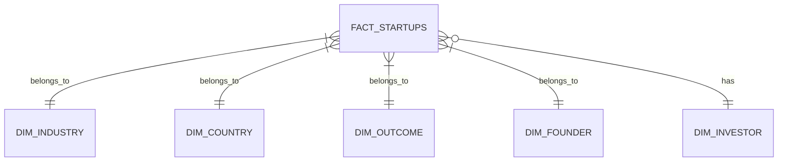

# StartupIQ Data Warehouse Model

## 1. Overview

StartupIQ uses a star schema designed for analytics and dashboarding. The model is optimized for Power BI, SQL-based analysis, and future ELT/ETL pipelines. Instead of storing all metrics in a single wide table, the design separates business dimensions from measurable facts.

## 2. Star Schema Design

### Fact Table

- fact_startups
  - Grain: one row per startup
  - Purpose: stores the measurable business facts and KPIs for each startup

### Dimension Tables

- dim_industry
- dim_country
- dim_outcome
- dim_founder
- dim_investor

## 3. ER Diagram

## 4. Table Descriptions

### fact_startups

| Column | Type | Description |
| --- | --- | --- |
| startup_id | VARCHAR(50) | Surrogate business key for each startup |
| industry_key | INTEGER | Foreign key to dim_industry |
| country_key | INTEGER | Foreign key to dim_country |
| outcome_key | INTEGER | Foreign key to dim_outcome |
| founder_key | INTEGER | Foreign key to dim_founder |
| investor_key | INTEGER | Foreign key to dim_investor |
| funding_rounds | INTEGER | Number of observed funding rounds |
| team_size | INTEGER | Team size |
| market_size_billion | DECIMAL | Market size in billions |
| product_traction_users | INTEGER | Product traction users |
| revenue_usd | DECIMAL | Revenue in USD |
| burn_rate_usd | DECIMAL | Burn rate in USD |
| burn_ratio | DECIMAL | Burn ratio |
| revenue_per_employee | DECIMAL | Revenue per employee |
| user_traction_per_employee | DECIMAL | Users per employee |
| capital_efficiency_ratio | DECIMAL | Capital efficiency ratio |

### dim_industry

| Column | Type | Description |
| --- | --- | --- |
| industry_key | INTEGER | Surrogate key |
| industry_name | VARCHAR(50) | Industry category |
| industry_group | VARCHAR(30) | Grouping used for high-level analysis |
| is_high_growth | BOOLEAN | Indicates whether the industry is high-growth |

### dim_country

| Column | Type | Description |
| --- | --- | --- |
| country_key | INTEGER | Surrogate key |
| country_name | VARCHAR(100) | Country name |
| country_code | VARCHAR(10) | ISO-like country code |
| is_known | BOOLEAN | Indicates whether the geography is confirmed |

### dim_outcome

| Column | Type | Description |
| --- | --- | --- |
| outcome_key | INTEGER | Surrogate key |
| outcome_name | VARCHAR(30) | Outcome such as Failure, Acquisition, or IPO |
| outcome_group | VARCHAR(20) | Non-Successful or Successful Exit |
| is_successful | BOOLEAN | Success flag |

### dim_founder

| Column | Type | Description |
| --- | --- | --- |
| founder_key | INTEGER | Surrogate key |
| founder_background | VARCHAR(50) | Founder background |
| founder_experience_years | INTEGER | Experience in years |
| experience_band | VARCHAR(20) | Experience band |
| founder_profile_label | VARCHAR(100) | Human-readable profile label |

### dim_investor

| Column | Type | Description |
| --- | --- | --- |
| investor_key | INTEGER | Surrogate key |
| investor_type | VARCHAR(30) | Investor type |
| investor_tier | VARCHAR(20) | Investor tier |
| is_active_investor | BOOLEAN | Marks investor participation |

## 5. Keys and Relationships

- Primary key: fact_startups.startup_id
- Foreign keys:
  - fact_startups.industry_key -> dim_industry.industry_key
  - fact_startups.country_key -> dim_country.country_key
  - fact_startups.outcome_key -> dim_outcome.outcome_key
  - fact_startups.founder_key -> dim_founder.founder_key
  - fact_startups.investor_key -> dim_investor.investor_key

## 6. Business Justification

- fact_startups is the analytics grain for KPI and performance reporting.
- dim_industry enables vertical-level benchmarking.
- dim_country supports future geographic reporting and regional analysis.
- dim_outcome provides an outcome-based analysis lens for investment and portfolio monitoring.
- dim_founder adds context for founder-quality and experience analysis.
- dim_investor supports funding-source analysis and investor strategy reporting.

## 7. Why This Model Fits StartupIQ

The star schema keeps the model simple for BI users while still supporting drill-down and slice-and-dice analysis. It avoids unnecessary normalization and prioritizes speed, intuitive joins, and dashboard performance.